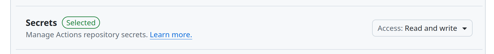

# github-actions-secrets-mgmt

This Actions project provides a tool to manage GitHub Actions secrets programmatically.

---
## Features
- Retrieve environment variables
- Generate authentication headers
- Retrieve public key details from GitHub
- Encrypt secrets using NaCl
- Save secrets to GitHub Actions

---
## Requirements
- Python 3.11+
- `requests` library
- `PyNaCl` library

---
## Usage

```yaml
- name: Create or update Github Actions secret
  uses: rennf93/github-actions-secrets-mgmt@v1.0
  with:
    OWNER: <github_handle>
    REPOSITORY: <target_repository>
    ACCESS_TOKEN: <personal_access_token>
    SECRET_NAME: <secret>
    SECRET_VALUE: <output-from-previous-step>
```

<i>where</i>

`OWNER` is the owner of the repository where the secret is to be created or updated. <b>Required</b>.

`REPOSITORY` is the name of the respository where the secret is to be created or updated. <b>Required</b>.

`ACCESS_TOKEN` is the personal access token (PAT) to use for authentication against the repository where the secret is stored. Using `secrets.GIHUB_TOKEN` [will not work](https://github.com/orgs/community/discussions/12424). Follow steps [here](https://docs.github.com/en/authentication/keeping-your-account-and-data-secure/managing-your-personal-access-tokens) to create one if you dont already have one. Besure to allow the token to be used to read user public keys.

<b>Required</b>:



`SECRET_NAME` is the name of the secret to be created or updated. <b>Required</b>.

`SECRET_VALUE` is value the secret should be set to. <b>Optional</b>. This should be an output from a previous step or job. For reference: [here](https://docs.github.com/en/actions/using-workflows/workflow-syntax-for-github-actions#jobsjob_idoutputs)


To view the newly created secret, navigate to settings >> secrets >> actions in the Github repository portal.

---
## References

1. [Create personal access token](https://docs.github.com/en/authentication/keeping-your-account-and-data-secure/managing-your-personal-access-tokens)
1. [Get repository public key](https://docs.github.com/en/rest/actions/secrets#get-a-repository-public-key)
1. [Create or update a repository secret
](https://docs.github.com/en/rest/actions/secrets#create-or-update-a-repository-secret)
1. [Custom actions](https://docs.github.com/en/actions/creating-actions/about-custom-actions)


